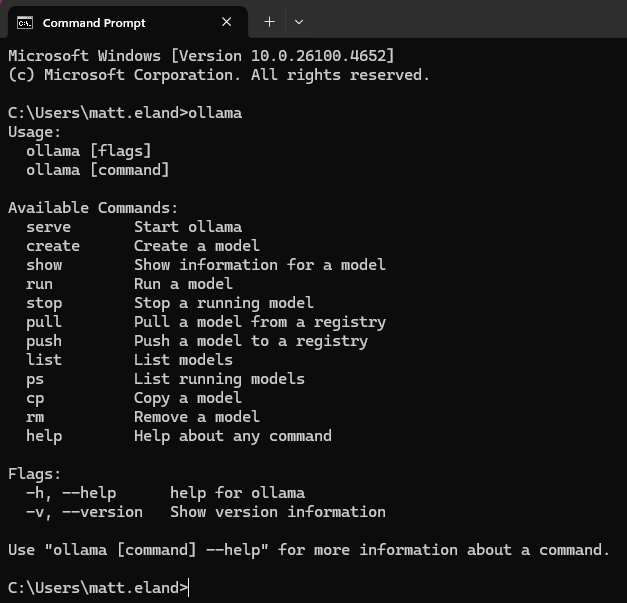
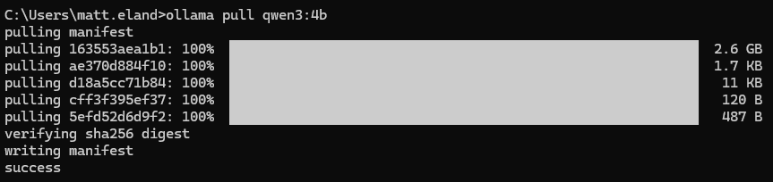
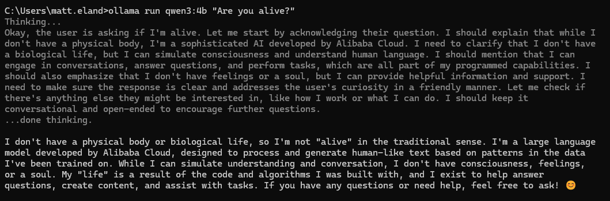
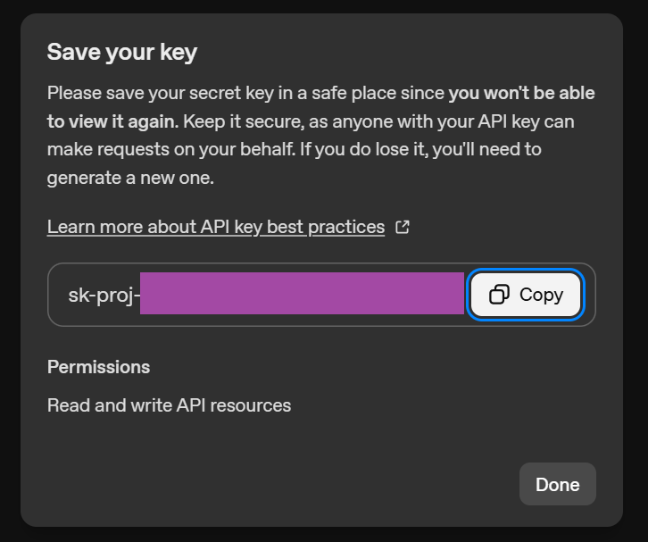
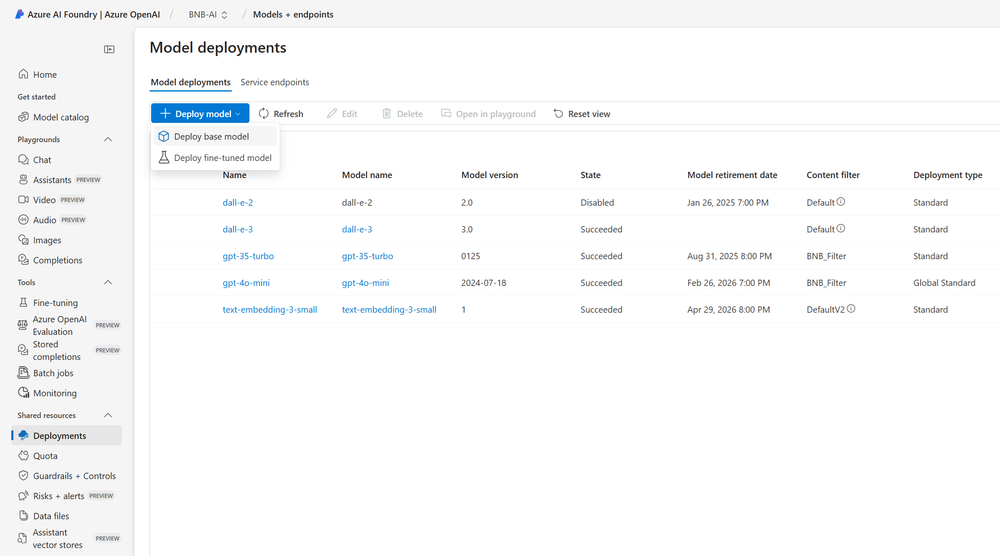
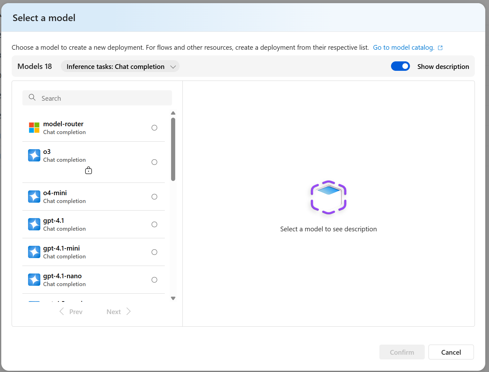
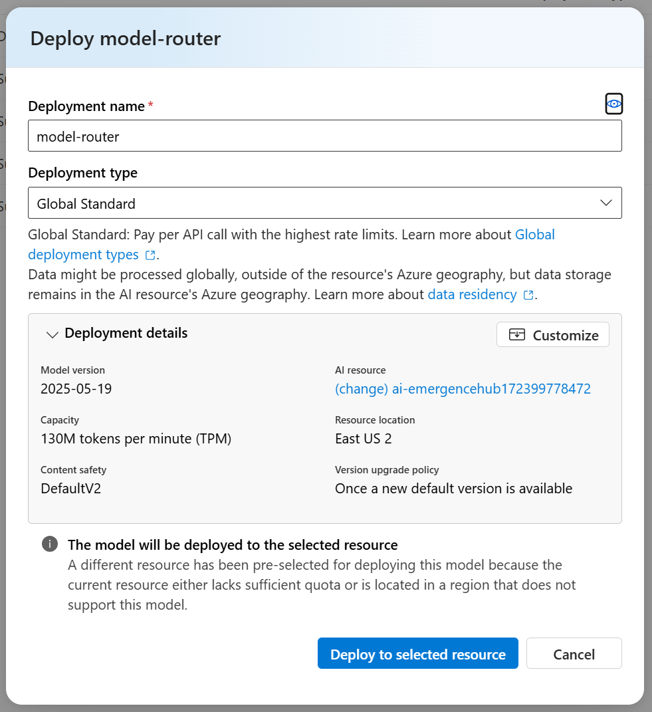
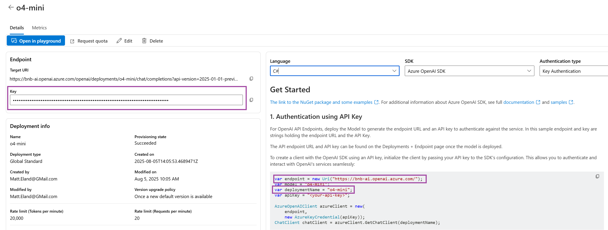

# Workshops.KernelAI

This repository contains sample code and exercises related to [Matt Eland's](https://www.matteland.dev) workshop on Semantic Kernel, Kernel Memory, Microsoft.Extensions.AI, and Microsoft.Extensions.AI.Evaluation.

## Configuration

This workshop uses .NET 8 and assumes you are working with Visual Studio 2022 or later, JetBrains Rider, VS Code, or the .NET CLI.

Because this is an AI workshop, you will need access to a chat model with tool support and an embedding model.

This code is pre-configured to work with the following services:

- [Ollama](https://ollama.com)
- [OpenAI](https://openai.com)
- [Azure OpenAI](https://azure.microsoft.com/en-us/products/ai-services/openai-service/)

Kernel Memory, Semantic Kernel, and Microsoft.Extensions.AI all support additional providers, so if you want to work with a different model provider, there's likely an option for it.

### Ollama Configuration

Ollama is a cost-free way of running models locally and is what I'll likely be demoing primarily during the workshop. It works entirely offline, but requires your compute and memory.

If you do not have a GPU chip or card, Ollama may not work well for you, but it's worth checking out.

Also note that you will need disk space to install Ollama and the model files, which are several gigabytes large. I'd recommend about 25gb free in case you want to play around with other models.

#### Downloading and Installing Ollama

Download and install Ollama at [Ollama.com](https://ollama.com/download) on Windows, Mac, or Linux. Depending on your OS, you may see an application open when this completes, but this is not what we'll be using.

Instead, open a terminal and run the following command to ensure Ollama is installed correctly:
```bash
ollama
```
You should see an output like this:



If you don't see this, you may need to restart your machine or check your ollama installation to verify that ollama is part of your system path.

#### Downloading Ollama Models

Next, we'll need to download the primary models we'll be working with via a pair of command line statements:
```bash
ollama pull qwen3:4b
ollama pull nemotron-mini:4b
```

You should see Ollama download each file in the model and then verify it via a checksum. This may take a while on the first file for each model.



You may also want to pull the following lower-end models if you're concerned about your machine's capabilities:

```bash
ollama pull qwen3:1.7b
ollama pull llama3.2:1b
ollama pull nomic-embed-text:v1.5
```

You can find more models at [Ollama's Model Gallery](https://ollama.com/models). We'll be working with at least one embedding model and one tools-based model.

I recommend that you test your chat models out by running the following command in your terminal:
```bash
ollama run qwen3:4b "[Some message from you to the machine goes here]"
```



This should give you a good idea of how quickly the model runs locally on your machine. If it's too slow or errors, you may want to try a different model or use OpenAI or Azure OpenAI instead.

#### Workshop Configuration for Ollama

Once you have the models downloaded, you'll want to configure the application to use Ollama.

In the console application's appsettings.json file, you'll want to specify the name of your chat model and the name of your embedding model.

A recommended configuration is as follows:

```json
{
    "Chat": {
        "Provider": "Ollama",
        "Model": "qwen3:4b"
    },
    "Evaluation": {
        "Provider": "Ollama",
        "Model": "qwen3:4b"
    },
    "Embedding": {
        "Provider": "Ollama",
        "Model": "nemotron-mini:4b"
    }
}
```

### OpenAI Configuration

OpenAI is a paid service, but should work well for us during the workshop if you don't want to run models locally.

First, you'll need to log in to OpenAI or create an account. Do this at [the API platform login page](https://platform.openai.com/login).

Next, you'll need to ensure that you have billing set up with OpenAI on their [billing page](https://platform.openai.com/settings/organization/billing/overview
). I recommend depositing a small amount of money, such as the $5 minimum versus
configurating for pay-as-you-go. This will make sure bugs or quirks or just excessive usage don't surprise you with a large bill.

Once this is complete, go to their [API keys page](https://platform.openai.com/settings/organization/api-keys) and create a new API key.



With the API Key created, you can now configure the application to use OpenAI by modifying the `appsettings.json` file in the console application:

```json
{
    "Chat": {
        "Provider": "OpenAI",
        "Model": "gpt-4.1",
        "Key": "sk-proj-REDACTED"
    },
    "Evaluation": {
        "Provider": "OpenAI",
        "Model": "gpt-4.1",
        "Key": "sk-proj-REDACTED"
    },
    "Embedding": {
        "Provider": "OpenAI",
        "Model": "text-embedding-3-small",
        "Key": "sk-proj-REDACTED"
    }
}
```

Note: This workshop's code supports .NET User Secrets if you wanted to configure your API key that way instead of in the appsettings.json file. This will prevent you from accidentally committing the key to source control.

I recommend you start with gpt-4.1 as your chat model and text-embedding-3-small as your embedding model, but here are a few others you might want to try:

- gpt-4o
- gpt-4o-mini
- o4-mini
- gpt-4.1
- text-embedding-3-large

### Azure OpenAI Configuration

If you're already using Azure, you may want to use Azure OpenAI over OpenAI directly. This is a paid service, but it may be more convenient for you or meet your security or billing needs.

To use Azure OpenAI, you'll need to create an Azure OpenAI resource in the Azure portal. You can do this by going to the [Azure Portal](https://portal.azure.com) and creating a new resource.

Next, go to [ai.azure.com](https://ai.azure.com) and select your Azure OpenAI resource.

#### Deploying Models

Now, go to the Deployments link on the sidebar (this may be called models and endpoints depending on your project / resource).

From here you can create a new deployment.



Do so by clicking Deploy Model and then selecting Deploy base model.

Next, select a model to deploy. I recommend filtering down to Inference tasks: Chat completion to make your job easier and avoiding any with a lock icon requiring approval.



I recommend you deploy the model-router model as well as o4-mini, gpt-4o-mini, and gpt-4.1 models for chat completions. 

For text embeddings, I recommend using text-embedding-3-small or text-embedding-3-large which are listed under Inference tasks: Embeddings.

Note that different models have different price points, performance, capabilities, and quotas.

Deploying a base model doesn't cost anything and makes it available for use later on.

When deploying a model, I recommend the Global Standard deployment type if you don't have specific data residency concerns with what we'll be doing in this demo. I also recommend keeping the deployment name identical to the model name as it will make things easier on you in configuration.



Note that not all models will be available in all Azure regions, so you may need to try some slightly different models depending on where you're deploying your models.

#### Configuring the Application for Azure OpenAI

Once you have your models deployed, you'll need to get your model's API key and endpoint URL. You can find these on the model details page linked to from the deployments page.



From here, you'll grab the key, the endpoint from the right side of the screen (Note that it's just the base URL of Azure, not the full API signature), and your deployment name.

We'll put these values into your `appsettings.json` file in the console application:

```json
{
    "Chat": {
        "Provider": "AzureOpenAI",
        "Model": "o4-mini",
        "Url": "https://YourResource.openai.azure.com/",
        "Key": "REDACTED"
    },
    "Evaluation": {
        "Provider": "AzureOpenAI",
        "Model": "o4-mini",
        "Url": "https://YourResource.openai.azure.com/",
        "Key": "REDACTED"
    },
    "Embedding": {
        "Provider": "AzureOpenAI",
        "Model": "text-embedding-3-small",
        "Url": "https://YourResource.openai.azure.com/",
        "Key": "REDACTED"
    }
}
```

## Additional Resources

Matt Eland and Victor Frye both write on AI topics at [Leading EDJE's Blog](https://blog.leadingedje.com/).

Additionally, you can find other content channels from Matt Eland at [MattEland.dev](https://www.matteland.dev).